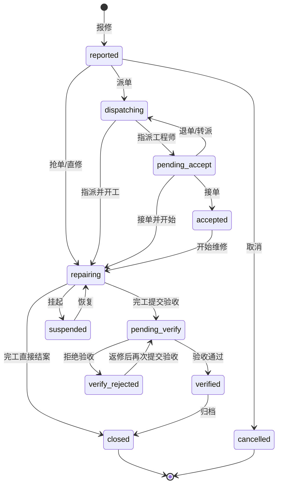

# 设备报修 / 维修工单业务流程

本文档描述 MEIS 维修模块的业务规则、工单状态、设备台账联动与时间轴设计，供产品、开发、实施同事统一理解。

相关代码：

- 后端：`meis-repair` → `RepairWorkorderController`
- 前端：`meis-web/src/views/repair/WorkorderListPage.vue`
- 迁移：`meis-tenant/.../tenant/V19__repair_workflow.sql`

---

## 1. 业务目标

临床科室报修后生成维修工单，设备科/工程师处理故障，直至设备恢复可用。系统需：

1. 支持 **标准派工** 与 **跳过派工直修** 两种路径
2. 支持 **提交验收** 与 **完工直接结案**
3. 支持工程师 **转派**
4. 用时间轴完整记录状态与耗时，划清责任时间界，减少纠纷

---

## 2. 角色与职责

| 角色 | 典型操作 |
|------|----------|
| 临床用户 | 报修、查看进度、验收 |
| 设备科调度 | 派单、改派、取消、查看 |
| 维修工程师 | 接单、直修、更新子状态、转派、完工、结案 |
| 系统管理员 | 配置字典、查看全量工单 |

当前阶段：**全租户开放派单与跳过派单**，不做租户级流程开关；后续可按租户配置收紧。

---

## 3. 双层状态模型

### 3.1 主状态 `status`（工单流程）

| 编码 | 中文 | 含义 | 设备台账状态 |
|------|------|------|--------------|
| `reported` | 报修中 | 临床已提交，尚未接手 | `maintenance` |
| `dispatching` | 派单中 | 调度正在分配工程师 | `maintenance` |
| `pending_accept` | 待接单 | 已指派，等待工程师确认 | `maintenance` |
| `accepted` | 已接单 | 工程师已确认接单 | `maintenance` |
| `repairing` | 维修中 | 工程师已介入处理 | `maintenance` |
| `pending_verify` | 已维修待验收 | 维修完工，等待科室确认 | **`pending_verify`** |
| `verify_rejected` | 拒绝验收 | 科室验收驳回，待工程师返修 | `maintenance` |
| `verified` | 已验收 | 科室验收通过 | `normal` |
| `closed` | 已关闭 | 工单归档（含跳过验收结案） | `normal` |
| `cancelled` | 已取消 | 误报、撤回、重复单 | 恢复为 `normal` |
| `suspended` | 已挂起 | 暂停处理 | `maintenance` |

> 注意：旧版字典中 `accepted` 表示「已验收」。新版 `accepted` = **已接单**，已验收改为 `verified`。存量数据由 V19 迁移脚本转换。

### 3.2 子状态 `repair_sub_status`（仅主状态为 `repairing` 时有效）

| 编码 | 中文 | 说明 |
|------|------|------|
| `internal` | 院内维修 | 本院工程师处理 |
| `external` | 院外维修 | 厂家/第三方（暂用子状态，后续可独立外协单） |
| `waiting_parts` | 等待配件 | 已诊断，备件未到 |
| `waiting_approval` | 待审批 | 费用/方案待批 |
| `on_site` | 已到场 | 已响应，尚未开工 |
| `diagnosing` | 诊断中 | 排查故障 |
| `testing` | 调试中 | 维修后测试 |

子状态可互相切换，**不改变主状态**。

### 3.3 设备台账 `device_status` 新增

| 编码 | 中文 | 使用场景 |
|------|------|----------|
| `pending_verify` | 已维修待验收 | 工单进入待验收时写入 |

目的：明确「工程师已完工、等待临床确认」的时间界，避免科室误以为仍在维修中而投诉。

---

## 4. 流程路径

### 4.1 标准派工

```
报修中 → 派单中 → 待接单 → 已接单 → 维修中 → 已维修待验收 → 已验收 → 已关闭
```

### 4.2 工程师抢单（跳过派单）

```
报修中 / 派单中（无负责人）→ 工程师抢单 → 维修中
```

- 仅 **维修工程师** 可抢单；工单须 **未指派负责人**
- 抢单使用条件更新防并发：`status IN ('reported','dispatching') AND assigned_user_id IS NULL`
- 抢单后直接 `repairing` + 子状态「院内维修」

### 4.3 跳过派单（派工直修）

```
报修中 → 维修中 → 已维修待验收 → 已验收 → 已关闭
```

### 4.4 完工直接结案（跳过验收）

```
… → 维修中 → 已关闭
```

设备台账直接恢复 `normal`，不经过 `pending_verify`。

### 4.5 验收不通过（拒绝验收 / 返修）

```
已维修待验收 → 拒绝验收（verify_rejected）→ …返修… → 已维修待验收 → …
```

- 主状态新增 **`verify_rejected`（拒绝验收）**，与「维修中」区分，便于列表筛选与审计
- 拒绝时必填 **拒绝验收原因**；设备台账保持 **`maintenance`**
- 工程师可在维修处理中继续更新子状态（院内维修、等待配件等），主状态保持 `verify_rejected`
- 返修完成后通过 **完工提交验收**（或等价「已维修待验收」进程段，见附录 U）→ `pending_verify`，可再次验收

### 4.6 转派

允许在 `dispatching` / `pending_accept` / `accepted` / `repairing` 转派（**仅当前负责人**）：

- 转派后通常回到 `pending_accept`（新工程师需接单）
- 也可选择「转派并继续维修」（保持 `repairing`，更换负责人）
- 每次转派写入事件表，主表仅保留当前 `assigned_user_id`

### 4.7 状态流转图



---

## 5. 时间轴

### 5.1 设计原则

用户打开工单详情应能看到：

1. 经历过的全部关键节点（含跳过）
2. 各阶段起止时间与耗时
3. 操作人 / 工程师
4. 转派、子状态变更、返修等详细事件

采用 **里程碑 + 事件流 + 时长摘要** 三层结构。

### 5.2 里程碑节点

| 节点 | 触发 | 时间字段 |
|------|------|----------|
| 报修提交 | 创建工单 | `report_time` |
| 开始派单 | 进入派单中 | `dispatch_started_at` |
| 指派工程师 | 待接单 | `assigned_at` |
| 工程师接单 | 已接单 | `accepted_at` |
| 开始维修 | 维修中 | `repair_start_time` |
| 到场 | 子状态/字段 | `arrival_time` |
| 维修结束 | 待验收或结案 | `repair_end_time` |
| 科室验收 | 已验收 | `verify_time` |
| 工单关闭 | 已关闭 | `closed_at` |

跳过的环节在时间轴上显示为「已跳过」，不隐藏。

### 5.3 事件表 `repair_workorder_event`

凡主状态 / 子状态变更、转派、挂起等，均写入事件表。时间轴 API 以事件为主数据源。

| event_type | 说明 |
|------------|------|
| `created` | 创建报修 |
| `dispatch` | 派单/指派 |
| `transfer` | 转派 |
| `accept` | 接单 |
| `reject` | 退单 |
| `start_repair` | 开始维修 |
| `sub_status_change` | 子状态变更 |
| `suspend` / `resume` | 挂起/恢复 |
| `complete` | 维修完工 |
| `submit_verify` | 提交验收 |
| `verify_pass` / `verify_fail` | 验收结果 |
| `close` | 关闭 |
| `cancel` | 取消 |

### 5.4 时长指标

| 指标 | 计算 |
|------|------|
| 总停机时长 | 关闭/取消时间 − `report_time` |
| 响应时长 | 接单或开始维修时间 − `report_time` |
| 维修作业时长 | `repair_end_time` − `repair_start_time`（可扣挂起） |
| 待验收时长 | `verify_time` − `repair_end_time` |
| 等待配件时长 | 子状态 `waiting_parts` 各段之和 |

---

## 5.6 维修进程段（REP-05）

除子状态事件外，工单详情展示 **进程段** `repair_workorder_segment`，用于划清院内/院外/等待配件/待验收/拒绝验收等 **业务阶段** 与配件归属。

### 主数据 `repair_process_type`

维护入口：`/repair/process-type`（通用 CRUD）。种子类型：

| type_code | 名称 | 允许配件 | 工程师可新增 |
|-----------|------|----------|--------------|
| `internal` | 院内维修中 | 是 | 是 |
| `external` | 院外维修中 | 是 | 是 |
| `waiting_parts` | 等待配件中 | 是 | 是 |
| `verify_rejected` | 拒绝验收 | 否 | 否（验收驳回时系统自动写入） |
| `pending_verify` | 已维修待验收 | 否 | **仅 `verify_rejected` 时可由工程师主动添加** |
| `verified` | 已验收 | 否 | 否（验收通过时系统自动写入） |

### 工单进程段 `repair_workorder_segment`

- 关联工单、进程类型、负责人（`user_id`）、开始/结束时间
- 工程师 **新增可编辑段** 时自动结束上一段（`ended_at`）
- **待派单**（`reported`）可直接添加首段，不必先派工；通常同步主状态 → `repairing`
- 派工开工、抢单、接单等动作也会自动开启对应进程段（如「院内维修中」）

### 配件明细 `repair_workorder_segment_part`

- 仅 `can_add_parts = true` 且 **未结束** 的进程段可挂配件
- 库存扣减与费用汇总见 REP-F-02（本轮不做）

### 与验收/返修联动

| 动作 | 进程段行为 |
|------|------------|
| 完工提交验收 | 系统自动开启「已维修待验收」段 |
| 验收通过 | 系统自动开启「已验收」段 |
| 拒绝验收 | 结束待验收段；系统自动写入「拒绝验收」段（含原因） |
| 返修后再待验收 | 工程师添加「已维修待验收」段 → 主状态 `pending_verify` |

### API

| 方法 | 路径 | 说明 |
|------|------|------|
| GET | `/api/repair/process-type/list` | 全部启用进程类型 |
| GET | `/api/repair/process-type/addable` | 当前工单可新增的进程类型 |
| GET | `/api/repair/workorder/{id}/segments` | 工单进程段列表（含配件） |
| POST | `/api/repair/workorder/{id}/segments` | 工程师添加进程段 |
| POST | `/api/repair/workorder/{id}/segments/{segmentId}/parts` | 进程段添加配件 |

---

## 5.7 流程业务表 `repair_workorder_process`

派工、接单、转派、子状态、完工、验收、挂起/恢复、取消等 **流程业务数据** 写入 `repair_workorder_process`；`repair_workorder` 主单仅同步 `status`、`repair_sub_status`、`assigned_user_id`。

| 字段组 | 说明 |
|--------|------|
| 状态变迁 | `action_type`、`from_status` / `to_status`、`from_sub_status` / `to_sub_status` |
| 人员 | `engineer_id`、`from_engineer_id` / `to_engineer_id`、`operator_id` |
| 完工 | `solution_description`、`labor_cost`、`parts_cost`、`total_cost`、`skip_verify` |
| 验收 | `verify_result`、`verify_comment`、`satisfaction_rating`、`satisfaction_comment` |

详情/列表 API 通过 `RepairWorkorderProcessService.enrichWorkorder` 将最新完工、验收、派工/接单时间等 **展示字段** 回填到主单 Map，前端无需改契约。`repair_workorder_event` 继续双写，供时间轴审计。

建表：`V1__tables.sql`；索引：`V2__indexes.sql` → `idx_wo_process_wo`。

---

## 6. API 一览

| 方法 | 路径 | 说明 |
|------|------|------|
| GET | `/api/repair/workorder/devices/candidates` | 可选报修设备（排除维修中/待验收等） |
| GET | `/api/repair/workorder/{id}` | 工单详情（流程字段由 `repair_workorder_process` enrich 回填） |
| GET | `/api/repair/workorder/{id}/process` | 流程业务记录列表（按时间升序） |
| GET | `/api/repair/workorder/{id}/timeline` | 时间轴（摘要+里程碑+事件） |
| GET | `/api/repair/workorder/{id}/segments` | 进程段列表（含配件） |
| GET | `/api/repair/process-type/addable` | 当前工单可新增进程类型 |
| POST | `/api/repair/workorder/{id}/segments` | 添加进程段 |
| POST | `/api/repair/workorder/{id}/segments/{segmentId}/parts` | 进程段添加配件 |
| POST | `/api/repair/workorder` | 创建报修 |
| POST | `/api/repair/workorder/{id}/dispatch` | 派单/指派 |
| POST | `/api/repair/workorder/{id}/start-repair` | 跳过派单直修 / 开始维修 |
| POST | `/api/repair/workorder/{id}/accept` | 接单 |
| POST | `/api/repair/workorder/{id}/transfer` | 转派 |
| POST | `/api/repair/workorder/{id}/sub-status` | 更新维修子状态 |
| POST | `/api/repair/workorder/{id}/complete` | 完工（可提交验收或直接结案） |
| POST | `/api/repair/workorder/{id}/verify` | 验收 |
| POST | `/api/repair/workorder/{id}/suspend` | 挂起 |
| POST | `/api/repair/workorder/{id}/resume` | 恢复 |
| POST | `/api/repair/workorder/{id}/cancel` | 取消 |

列表分页仍走通用 CRUD：`GET /api/repair/repair_workorder/page`。

---

## 7. 前端操作按钮（按状态）

**入口约定（2026-07-14）**：

| 操作 | 列表操作列（维修处理） | 详情底栏 |
|------|------------------------|----------|
| **派工** | ✓ | ✗（已移出） |
| **取消** | ✓ | ✗（已移出） |
| **添加进程** | ✓（当前账号为维修工程师且可编） | ✓ |
| 抢单 / 接单 / 转派 / 子状态 / 完工 / 挂起 / 恢复 | — | ✓ |

工程师下拉接口：`GET /api/repair/engineer/options`（`is_repair_engineer=true` 的启用用户）。

| 当前状态 | 可用操作 |
|----------|----------|
| 报修中 | 派工、开始维修（直修）、取消；工程师可抢单/添加首段进程 |
| 派单中 / 待接单 | 改派、接单、开始维修、取消 |
| 已接单 | 开始维修、转派 |
| 维修中 | 更新子状态、**添加进程**、转派、完工、挂起 |
| 拒绝验收 | **添加进程**（返修/再次待验收）、转派、更新子状态 |
| 已挂起 | 恢复、取消 |
| 已维修待验收 | 验收通过、验收不通过 |
| 已验收 | 关闭（若未自动关闭） |
| 已关闭 / 已取消 | 仅查看 |

> **添加进程** 仅对 **当前登录用户** 满足：① `is_repair_engineer=true`；② 未派单时可加首段，或已是工单负责人。仅在他人用户上勾选「维修工程师」不够，调度账号自己也要开启该开关。

完工时可选：

- **提交验收**（默认）→ `pending_verify` + 设备 `pending_verify`
- **直接结案** → `closed` + 设备 `normal`

---

## 8. 数据脚本说明

维修相关结构已并入统一脚本（不再单独增加 V19）：

| 变更 | 位置 |
|------|------|
| `repair_workorder` 新字段、`repair_workorder_event` 建表 | `V1__tables.sql` |
| `repair_workorder_process` 流程业务表 | `V1__tables.sql` |
| 流程表索引 `idx_wo_process_wo` | `V2__indexes.sql` |
| 老租户业务补列 / 状态与字典同步 | `R__columns_biz.sql` / `R__data_fix.sql` |
| 新租户字典种子 | `V3__seed_data.sql` |

存量状态映射（由 R__ 幂等执行）：

| 旧值 | 新值 |
|------|------|
| `dispatched` | `pending_accept` |
| `in_progress` | `repairing` |
| `completed` | `pending_verify` |
| `accepted`（且已有验收时间） | `verified` |

详见 [meis-tenant db README](../meis-tenant/src/main/resources/db/README.md)。

---

## 9. 后续可选增强

- 租户级配置：`require_dispatch`、`require_verify`
- 外协单独立单据
- 时间轴导出 PDF
- 一单多工程师协办（当前仅支持转派单负责人）

---

## 10. 修订记录

| 日期 | 说明 |
|------|------|
| 2026-07-10 | 初版：状态定稿、时间轴设计、与实现同步 |
| 2026-07-13 | BACKLOG-REP-01：流程业务表 `repair_workorder_process`，主单仅同步状态 |
